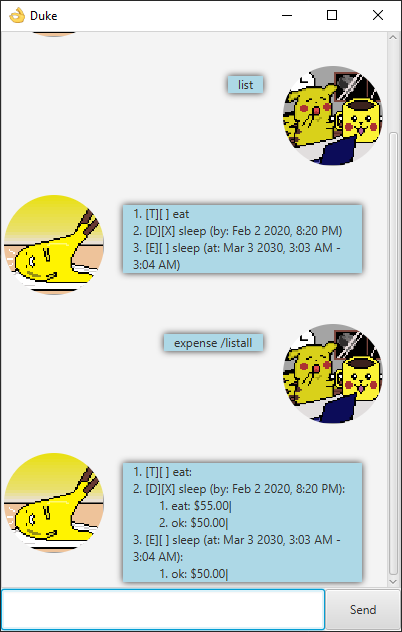

# User Guide

## Quick Start
1. Ensure that `Java 11` or higher is installed in your computer.
2. Download the latest release version of duke.jar from this page.
3. Copy the file to the folder you want to use as the home folder for Duke.
4. Double click the file to run. The GUI similar to the one below should appear.


## Features 
### Manage various Tasks (Deadlines, Todos, Events)

Duke can manage your Deadlines, Events and Todos for you. You are also able to mark these Tasks as "done".

### Manage expenses spent on these Tasks

Duke can record expenses spent on Tasks. It can also sum up all expenses spent in the list of Tasks or just
for a specified Task.

### Saving and loading Tasks and expenses

Tasks and expenses logged will be saved and can be reloaded when Duke runs again.

## Usage

Notes about command format:
* Words in `UPPER_CASE` are the parameters to be supplied by the user.
* `[NUMBER]` in the sample output represents the number of Tasks currently in the Task list.
* `[DATE]` represents the appropriate date format which is YYYY/MM/DD.
* `[TIME]` represents the appropriate time format which is HHMM.

### `bye` - Exits Duke

Exits the program.

### `todo` - Adds a Todo

Adds a Todo to the Task list.

Format: `todo DESCRIPTION`

Example of usage: `todo sleep`

Expected outcome: A Todo of `DESCRIPTION` will be added to the Task list.

```
Got it. I've added this task:
[T][ ] sleep
Now you have [NUMBER] tasks in the list.
```

### `deadline` - Adds a Deadline

Adds a Deadline to the Task list.

Format: `deadline DESCRIPTION /by [DATE] [TIME]`

Example of usage: `deadline sleep /by 2020/02/02 2020`

Expected outcome: A Deadline of `DESCRIPTION` and appropriate date and time will be added to the Task list.

```
Got it. I've added this task:
[D][ ] sleep (by: Feb 2 2020, 8:20 PM)
Now you have [NUMBER] tasks in the list.
```

### `event` - Adds an Event

Adds a Deadline to the Task list.

Format: `event DESCRIPTION /at [DATE] [TIME] - [TIME]`

Example of usage: `deadline sleep /at 2020/02/02 2020 - 1200`

Expected outcome: An Event of `DESCRIPTION` and appropriate date and time will be added to the Task list.

```
Got it. I've added this task:
[D][ ] sleep (at: Feb 2 2020, 2:00 AM - 12:00 PM)
Now you have [NUMBER] tasks in the list.
```

### `list` - Lists all Tasks

Lists all Tasks currently in the Task list.

Format: `list`

Expected outcome: All Tasks within the Task list will be shown on screen in an ordered list.

```
1. [T][ ] sleep
2. [D][ ] sleep (by: Feb 2 2020, 8:20 PM)
3. [D][ ] sleep (at: Feb 2 2020, 2:00 AM - 12:00 PM)
```

### `done` - Marks a Task as "done"

Marks a Task as "done".

Format: `done INDEX`

Example of usage: `done 2`

Expected outcome: Task at specified `INDEX` will be marked as "done" if it has not already been marked as done
else a message to inform you that at has already been marked "done" will appear.

Mark done:
```
Nice! I've marked this task as done:
[D][X] sleep (at: Feb 2 2020, 2:00 AM - 12:00 PM)
```

Already marked done:
```
[D][X] sleep (at: Feb 2 2020, 2:00 AM - 12:00 PM) has already been marked as done!
```

### `delete` - Deletes a Task

Deletes a Task from the Task list

Format: `delete INDEX`

Example of usage: `delete 2`

Expected outcome: Task at `INDEX` will be deleted from the Task list

```
Noted. I've removed this task:
[D][ ] sleep (at: Feb 2 2020, 2:00 AM - 12:00 PM)
Now you have [NUMBER] tasks in the list.
```

### `find` - Finds Tasks

Finds and return all Tasks that contain the query

Format: `find QUERY`

Example of usage: `find eep`

Expected outcome: An Event of `DESCRIPTION` and appropriate date and time will be added to the Task list.

```
1. [T][ ] sleep
2. [D][ ] sleep (at: Feb 2 2020, 2:00 AM - 12:00 PM)
```

### `expense` - Manipulate Task expenses

Behavior varies based on user input. Can add, delete and sum expenses within a Task. Can also
sum all expenses in the Task list.

Format: 
* `expense INDEX DESCRIPTION $AMOUNT`
* `expense INDEX /sum`
* `expense /listall`
* `expense /sumall`
* `expense INDEX /delete`

Examples of usage:
1. `expense 1 buy pillow $50`
2. `expense 1 /sum`
3. `expense /listall`
4. `expense /sumall`
5. `expense 1 /delete 1`

Expected outcome: An Event of `DESCRIPTION` and appropriate date and time will be added to the Task list.
1.
```
I added buy bolster: $50.00 to [T][ ] sleep!
```

2.
```
$50.00 spent on [T][ ] sleep!
```

3.
```
1. [T][ ] sleep:
    1. buy bolster: $50.00|
2. [D][ ] sleep (at: Feb 2 2020, 2:00 AM - 12:00 PM):
```

4.
```
$50.00
```

5.
```
I deleted:
buy bolster
from [T][ ] sleep!
```
